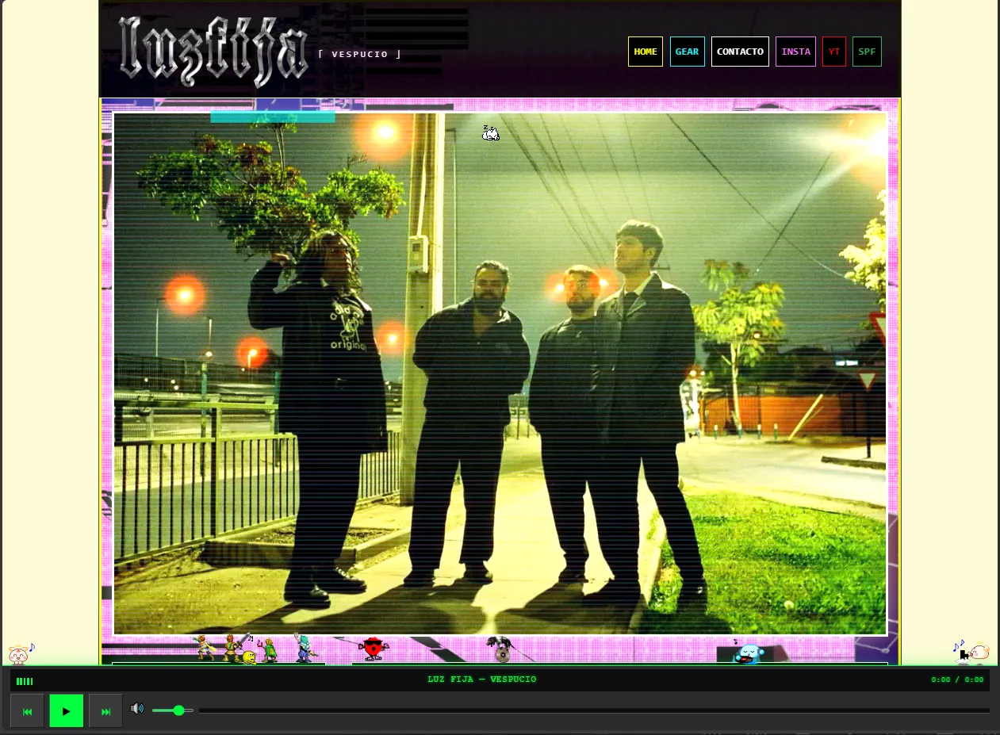
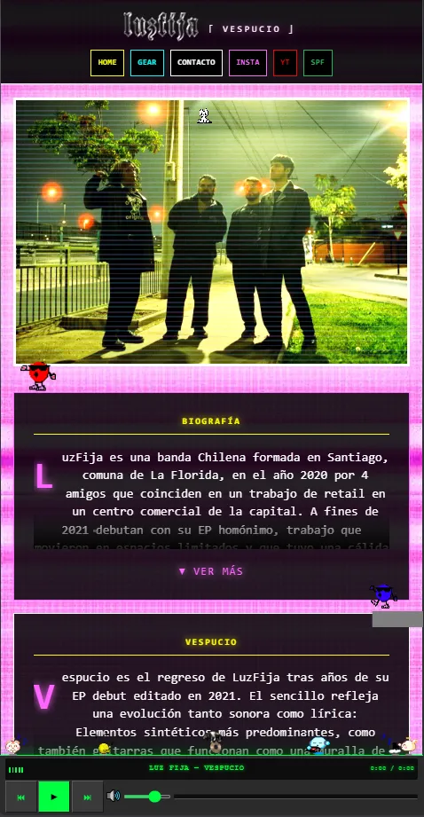
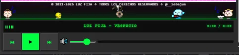

<p align="center">
  
</p>


> Sitio web oficial de la banda **Luz Fija**. Booking, portafolio, fechas y lanzamiento del EP "Vespucio".

🔗 **Visita la web en:** [www.luzfija.com](https://www.luzfija.com)

---

## 📸 Capturas de pantalla

| Vista principal | Vista móvil | Reproductor Winamp |
|-----------------|-------------|-------------------|
|  |  |  |

---

## ✨ Características principales

- 🎵 **Landing page** con la identidad visual de la banda.
- 📅 **Calendario de fechas** de próximos shows.
- 🖼️ **Galería de fotos** de la banda.
- 🎧 **Reproductor tipo Winamp** para el lanzamiento de *Vespucio EP*.
- 🎨 **Estilo personal y único**, no replicable directamente.
- 🌐 **Navegación fluida** con React Router.
- ⚡ **Rendimiento optimizado** con Vite.

---

## 🛠️ Tecnologías utilizadas

- **Frontend:** React 19
- **Bundler:** Vite
- **Enrutamiento:** React Router
- **Hosting:** AWS S3 + CloudFront
- **Despliegue:** Script personalizado con AWS CLI
- **Estilos:** CSS

---

## 🚀 Despliegue en AWS

El sitio está alojado en **AWS S3** como sitio web estático, con **CloudFront** como CDN para mejorar la velocidad y seguridad.

### Comando de despliegue

```bash
npm run deploy --bucket=TU-BUCKET-S3 --distribution=TU-ID-CLOUDFRONT
```

> También puedes usar las variables de entorno `AWS_S3_BUCKET` y `AWS_CF_DISTRIBUTION_ID` para no exponer valores en el repositorio.
